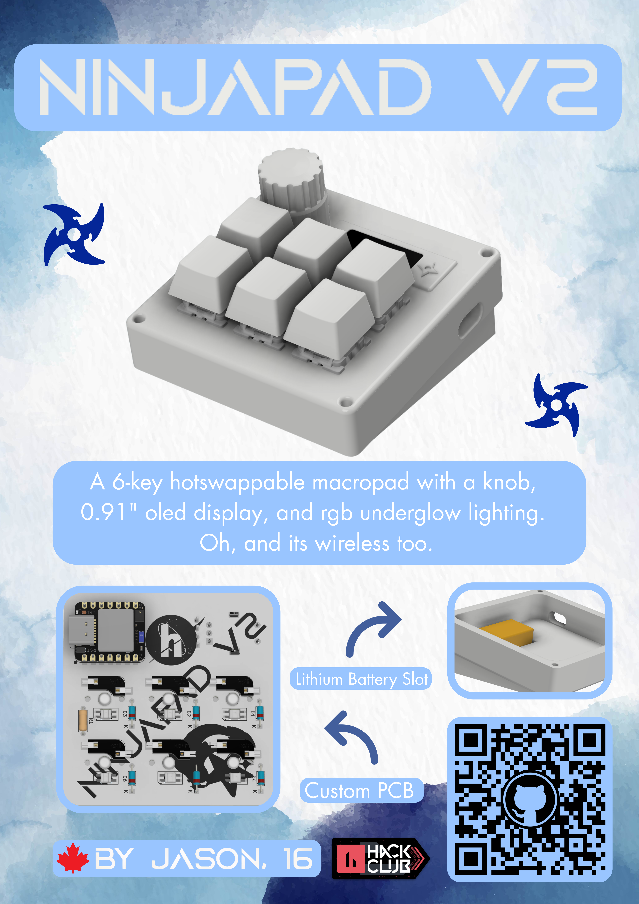

# Ninjapad-V2
The Ninjapad-V2 is a wireless macropad with 6 switches, a customizable knob, and a 0.91" oled display! It is fully hot-swappable, uses a 3.7V 600mAh rechargable lithium battery, and has mini-leds. By using ZMK firmware, it can wirelessly connect to your device and function as usual.

This is my second time creating a macropad; my first design was very basic and bland. I wanted to create something that was more advanced, had more features, and looked cooler, which is why I decided to have another go though NinjapadV2.

# Fallout Zine

# Renders

# Layout
I decided to go with a 6-key layout as I do not need too many macros. It's a good mix between looking clean, while providing functionality.

# Schematic
The pcb for NinjapadV2 was designed in kicad, and a modified 3x3 matrix is used. **Note:** The wiring for the lithium battery was not included in the schematic. The positive side of the battery is wired to the bat+ pad on the bottom of the xiao, and the negative side is wired to bat-.

# PCB
The xiao is located on the top right corner for easy access when you need to plug it in. The silkscreen includes the name "NinjaboardV2" written diagonally, the Hackclub/Nasa logo, and a Hackclub Milkyway star sticker.

# Assembly Guide
1. Solder the headerpins to the xiao, then the xiao to the pcb. Solder the rotary encoder, kailh hot swap sockets, oled display, mini leds, diodes, resistor, and oled display to the pcb as well. Make sure to cut off any legs or pins that are sticking out.
2. Solder the positive end of your litium battery to bat+ on the underside of the xiao, and the negative side to bat-.
3. After printing out the peices, use a soldering iron set to 200°C to slowly press in the 4 heatset inserts into their designated locations in the main body of the macropad.
4. Snap the keyswitches onto the plate, and place it ontop of the pcb, making sure to align the keyswich pins into the hot swap sockets. Place the knob cap over the rotary encoder.
5. Place the battery in the designated location in the base, and cover it with the connected pcb and plate. Screw in the plate using the m2 screws.
   
# Firmware Flashing Steps
1. Download the .uf2 file found in the Firmware folder.
2. Plug the xiao into your device. Press the tiny reset button twice, and a new usb drive called Xiao-BLE should appear.
3. Copy and paste the .uf2 file into the drive.
4. Open the bluetooth settings on your device, and the name "NinjapadV2" should appear. Click to pair.
5. Your new NinjapadV2 should be ready to go!
   
# BOM
|Item|Part Name              |Quantity|Description                    |Cost (USD)|Link                                                                                                                                                                                                                                                                                                                                                                                                                                                                                                                                                                                                                                                                                                       |
|----|-----------------------|--------|-------------------------------|----------|-----------------------------------------------------------------------------------------------------------------------------------------------------------------------------------------------------------------------------------------------------------------------------------------------------------------------------------------------------------------------------------------------------------------------------------------------------------------------------------------------------------------------------------------------------------------------------------------------------------------------------------------------------------------------------------------------------------|
|1   |Custom PCB             |5       |Printed Circut Board           |$2        |https://jlcpcb.com/                                                                                                                                                                                                                                                                                                                                                                                                                                                                                                                                                                                                                                                                                        |
|2   |Xiao nRF52840          |1       |Microcontroller                |$13.56    |https://www.aliexpress.com/item/1005006988944671.html?spm=a2g0o.productlist.main.1.26c47362JhrW93&algo_pvid=a8527b8d-12b0-40b0-9e80-fb8d44be5472&algo_exp_id=a8527b8d-12b0-40b0-9e80-fb8d44be5472-0&pdp_ext_f=%7B%22order%22%3A%22344%22%2C%22eval%22%3A%221%22%2C%22fromPage%22%3A%22search%22%7D&pdp_npi=6%40dis%21CAD%2137.78%2118.89%21%21%21179.99%2189.99%21%402101ea8c17808543304102701ea0b8%2112000051690441650%21sea%21CA%217451194651%21X%211%210%21n_tag%3A-29919%3Bd%3A8fd05d1b%3Bm03_new_user%3A-29895&curPageLogUid=pFjYSvoeQgMf&utparam-url=scene%3Asearch%7Cquery_from%3A%7Cx_object_id%3A1005006988944671%7C_p_origin_prod%3A                                                             |
|3   |Gateron Yellow Switches|5       |Key switches, serve as input   |$6.24     |https://www.aliexpress.com/item/1005008685972487.html?spm=a2g0o.productlist.main.3.65732540dYl2GP&algo_pvid=cc874fa9-8f9a-4fc1-8beb-a167023295a2&algo_exp_id=cc874fa9-8f9a-4fc1-8beb-a167023295a2-2&pdp_ext_f=%7B%22order%22%3A%22234%22%2C%22spu_best_type%22%3A%22price%22%2C%22eval%22%3A%221%22%2C%22fromPage%22%3A%22search%22%7D&pdp_npi=6%40dis%21CAD%2120.31%218.70%21%21%2196.76%2141.44%21%402101c59117808545475013713e48d3%2112000046260429586%21sea%21CA%217451194651%21X%211%210%21n_tag%3A-29919%3Bd%3A8fd05d1b%3Bm03_new_user%3A-29895%3BpisId%3A5000000208502900&curPageLogUid=W5X1cJpDGLWv&utparam-url=scene%3Asearch%7Cquery_from%3A%7Cx_object_id%3A1005008685972487%7C_p_origin_prod%3A|
|4   |Blank White Keycaps    |10      |Protection                     |$4.59     |https://www.aliexpress.com/item/1005004902730327.html?spm=a2g0o.productlist.main.8.399aBeKpBeKpgf&algo_pvid=bc9fbdb6-efda-447c-8913-e4d38307cf85&algo_exp_id=bc9fbdb6-efda-447c-8913-e4d38307cf85-8&pdp_ext_f=%7B%22order%22%3A%22887%22%2C%22spu_best_type%22%3A%22price%22%2C%22eval%22%3A%221%22%2C%22fromPage%22%3A%22search%22%7D&pdp_npi=6%40dis%21CAD%216.05%216.05%21%21%214.25%214.25%21%40210328d417808546269024304e96cf%2112000033043765234%21sea%21CA%217451194651%21X%211%210%21n_tag%3A-29919%3Bd%3A8fd05d1b%3Bm03_new_user%3A-29895&curPageLogUid=ISz0zQTMmX4W&utparam-url=scene%3Asearch%7Cquery_from%3A%7Cx_object_id%3A1005004902730327%7C_p_origin_prod%3A                              |
|5   |Kailh Hot-swap Sockets |10      |Allows hot-swapping of switches|$3.17     |https://www.aliexpress.com/item/1005007232040760.html?spm=a2g0o.order_list.order_list_main.35.38ca1802hz0ATr                                                                                                                                                                                                                                                                                                                                                                                                                                                                                                                                                                                               |
|6   |Rotary Encoder         |1       |You can rotate it              |$5.53     |https://www.digikey.ca/en/products/detail/alps-alpine/EC11E15244B2/19529170                                                                                                                                                                                                                                                                                                                                                                                                                                                                                                                                                                                                                                |
|7   |Encoder Knob cap       |1       |Protection                     |$4.08     |https://www.aliexpress.com/item/1005006531154080.html?spm=a2g0o.order_list.order_list_main.5.256d1802T4w9tK                                                                                                                                                                                                                                                                                                                                                                                                                                                                                                                                                                                                |
|8   |M2 Heatset Inserts     |100     |Threaded metal hole, L3xOD 3.2 |$3.17     |https://www.aliexpress.com/item/1005006838108683.html?spm=a2g0o.cart.0.0.1c1b38dalGfMuU&mp=1&pdp_npi=6%40dis%21CAD%21CAD+5.20%21CAD+5.20%21%21CAD+5.20%21%21%21%4021033d9d17760010503013922ef23d%2112000038467725083%21ct%21CA%217451194651%21%211%210%21                                                                                                                                                                                                                                                                                                                                                                                                                                                  |
|9   |M2 Screw               |50      |4mm long screw                 |$1.51     |https://www.aliexpress.com/item/32973784147.html?spm=a2g0o.productlist.main.1.304apnmvpnmvhX&algo_pvid=8e4bcfb2-c0a1-48f2-ad5e-84593aa7934a&algo_exp_id=8e4bcfb2-c0a1-48f2-ad5e-84593aa7934a-0&pdp_ext_f=%7B%22order%22%3A%227855%22%2C%22spu_best_type%22%3A%22price%22%2C%22eval%22%3A%221%22%2C%22fromPage%22%3A%22search%22%7D&pdp_npi=6%40dis%21CAD%212.26%212.26%21%21%211.60%211.60%21%402101e2b417760020144634724ef5ec%2112000024189797294%21sea%21CA%217451194651%21X%211%210%21n_tag%3A-29912%3Bd%3A8fd05d1b%3Bm03_new_user%3A-29895&curPageLogUid=kvh1vbqAtJaq&utparam-url=scene%3Asearch%7Cquery_from%3A%7Cx_object_id%3A32973784147%7C_p_origin_prod%3A                                       |
|10  |1N4148 Diodes          |100     |Prevent kb switch ghosting     |$1.36     |https://www.aliexpress.com/item/4001126137167.html?spm=a2g0o.productlist.main.5.79e7482dKtCmX2&algo_pvid=318c005b-3483-41ec-a5f5-6fc5037bbfee&algo_exp_id=318c005b-3483-41ec-a5f5-6fc5037bbfee-4&pdp_ext_f=%7B%22order%22%3A%221233%22%2C%22eval%22%3A%221%22%2C%22fromPage%22%3A%22search%22%7D&pdp_npi=6%40dis%21CAD%211.89%211.89%21%21%211.33%211.33%21%402101c44517808548772467266e39aa%2110000014629985518%21sea%21CA%217451194651%21X%211%210%21n_tag%3A-29919%3Bd%3A8fd05d1b%3Bm03_new_user%3A-29895&curPageLogUid=gGlbxJ80xgK9&utparam-url=scene%3Asearch%7Cquery_from%3A%7Cx_object_id%3A4001126137167%7C_p_origin_prod%3A                                                                       |
|11  |0.91 inch OLED 128x32  |1       | 0.91" Display Blue            |$2.07     |https://www.aliexpress.com/item/1005004572487969.html?spm=a2g0o.productlist.main.5.28c7bb6tbb6tCz&algo_pvid=24ca4424-442d-4cf5-a3ab-500681c94454&algo_exp_id=24ca4424-442d-4cf5-a3ab-500681c94454-4&pdp_ext_f=%7B%22order%22%3A%223252%22%2C%22spu_best_type%22%3A%22price%22%2C%22eval%22%3A%221%22%2C%22fromPage%22%3A%22search%22%7D&pdp_npi=6%40dis%21CAD%213.55%213.55%21%21%212.45%212.45%21%402101d9ef17839472626645394e0f27%2112000029674573174%21sea%21CA%217451194651%21X%211%210%21n_tag%3A-29919%3Bd%3Ab58c364f%3Bm03_new_user%3A-29895&curPageLogUid=NmXXvZPH981j&utparam-url=scene%3Asearch%7Cquery_from%3A%7Cx_object_id%3A1005004572487969%7C_p_origin_prod%3A                             |
|12  |SK6812 Mini-E RGBW     |20      |RGB Lights                     |$2.50     |https://www.aliexpress.com/item/1005005193716172.html?spm=a2g0o.productlist.main.3.a076T6PrT6PrJF&algo_pvid=f109bb1d-d3c7-435c-bcb0-0381f6c9a9b2&algo_exp_id=f109bb1d-d3c7-435c-bcb0-0381f6c9a9b2-2&pdp_ext_f=%7B%22order%22%3A%22340%22%2C%22spu_best_type%22%3A%22price%22%2C%22eval%22%3A%221%22%2C%22fromPage%22%3A%22search%22%7D&pdp_npi=6%40dis%21CAD%215.98%215.79%21%21%2128.49%2127.59%21%402101e2b417808554316812966ec6c8%2112000032072424634%21sea%21CA%217451194651%21X%211%210%21n_tag%3A-29919%3Bd%3A8fd05d1b%3Bm03_new_user%3A-29895&curPageLogUid=HfZZAMs5AZij&utparam-url=scene%3Asearch%7Cquery_from%3A%7Cx_object_id%3A1005005193716172%7C_p_origin_prod%3A                            |
|13  |Anti-slip Rubber pads  |50      |Prevent sliding                |$1.82     |https://www.aliexpress.com/item/1005008384264974.html?spm=a2g0o.productlist.main.5.311e6eceErL6jS&algo_pvid=f31db234-3426-481a-8b61-49df5adcf490&algo_exp_id=f31db234-3426-481a-8b61-49df5adcf490-4&pdp_ext_f=%7B%22order%22%3A%22986%22%2C%22spu_best_type%22%3A%22price%22%2C%22eval%22%3A%221%22%2C%22fromPage%22%3A%22search%22%7D&pdp_npi=6%40dis%21CAD%212.28%211.85%21%21%211.60%211.30%21%402103129017808559113205351eb105%2112000044801616190%21sea%21CA%217451194651%21X%211%210%21n_tag%3A-29919%3Bd%3A8fd05d1b%3Bm03_new_user%3A-29895&curPageLogUid=poOU9u8loeG4&utparam-url=scene%3Asearch%7Cquery_from%3A%7Cx_object_id%3A1005008384264974%7C_p_origin_prod%3A                              |
|14  |Lithium Battery        |1       |3.7V 600mAh rechargable        |$6.19     |https://www.aliexpress.com/item/1005009734239153.html?spm=a2g0o.productlist.main.1.4e3558pL58pLhQ&algo_pvid=233dbada-a420-4553-8722-a78dadbc389f&algo_exp_id=233dbada-a420-4553-8722-a78dadbc389f-0&pdp_ext_f=%7B%22order%22%3A%22504%22%2C%22spu_best_type%22%3A%22price%22%2C%22eval%22%3A%221%22%2C%22fromPage%22%3A%22search%22%7D&pdp_npi=6%40dis%21CAD%2111.50%218.62%21%21%2154.81%2141.11%21%40210311c217808574206456289eb7b7%2112000049985375130%21sea%21CA%217451194651%21X%211%210%21n_tag%3A-29919%3Bd%3A8fd05d1b%3Bm03_new_user%3A-29895&curPageLogUid=wFmcyCzzIm6O&utparam-url=scene%3Asearch%7Cquery_from%3A%7Cx_object_id%3A1005009734239153%7C_p_origin_prod%3A#nav-description           |
|    |                       |        |                               |          |                                                                                                                                                                                                                                                                                                                                                                                                                                                                                                                                                                                                                                                                                                           |
|    |                       |        |Total Cost                     |$57.79    |         
